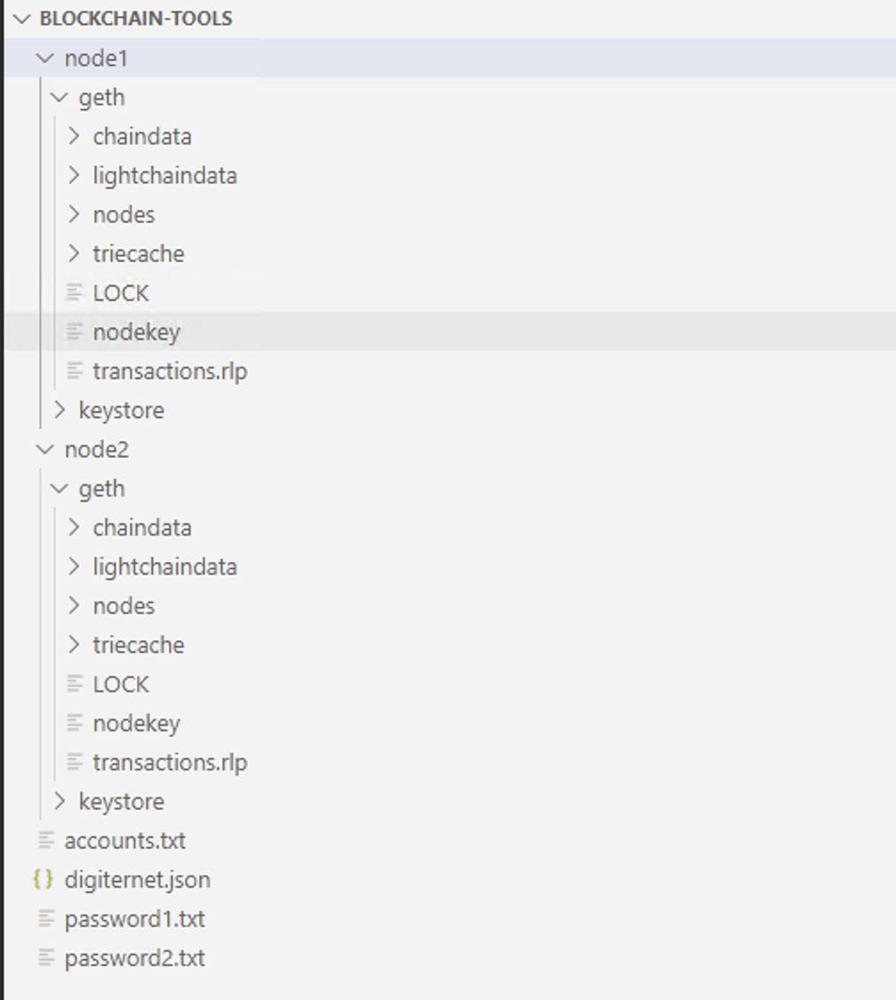

# fintech-blockchain-homework

This repository contains custom testnet blockchain, test transaction
and instructions, accompanied with tools and algorithm as part 
of the Fintech homework assignment Unit 18—Proof of Authority
Development Chain.

In this homework assignment, we are helping a fictitous bank to
explore potentials for blockchain technology by setting up a private
testnet, which allow for offline development.
 We are using tools and algorithm:

    - Puppeth, to generate genesis block.
    - Geth, a command-line tool, to create keys, initialize nodes,
    and connect the nodes together.
    - The Clique Proof of Authority algorithm - Proof of authority
    (PoA) is a consensus algorithm which is used with blockchains
    that delivers comparatively fast transactions through a
    consensus mechanism based on identity as a stake. It allows
    specific addresses to mine blocks and it is only used for
    development and testing in testnet blockchains.

## Steps to setup custom testnet blockchain

1. **Install MyCrypto Desktop App**
    - Open browser and navigate to the downloads page at https:/
    download.mycrypto.com/.
    - Depending on the operating system, choose the appropriate
    installer.
    - Once downloaded the installer, open the file and follow the
    instruction in the installation wizard.

2. **Install Go Ethereum Tools** 
    - Open your browser and navigate to the Go Ethereum Tools
    download page at https://geth.ethereum.org/downloads/.
    - Scroll down to the "Stable Releases" section
    - Download "Geth & Tools 1.9.25"
    - Decompress the file "geth-alltools-windows-amd64-1.9
    25-e7872729.zip" and rename the folder as "Blockchain-tools".

3. **Running a Proof of Authority Blockchain**
    The Proof of Authority (PoA) algorithm is typically used 
    for private blockchain networks as it requires pre-approval 
    of, or voting in of, the account addresses that can 
    approve transactions (seal blocks).

    - Create accounts for two nodes for the network with a 
    separate datadir for each using geth.
        - ./geth --datadir node1 account new
        - ./geth --datadir node2 account new

    
    
    - Copy and save nodes in **accounts.txt** and passwords 
    in **password1.txt and password2.txt** for the furthur use.

    

    - Generate genesis block
        - Run the command **./puppeth**
        - Given the network name **digiternet**. We can give 
        any network name.
        - Type **2** to pick the **Configure new genesis** option.
        - Type **1** to **Create new genesis from scratch**.
        - Type **2** to choose **the Clique (Proof of Authority)**
        consensus algorithm.
        - Paste both account addresses from **accounts.tx** file 
        we saved previously.
        - Paste them again in the list of accounts to 
        pre-fund. There are no block rewards in PoA, so we'll
        need to pre-fund.
        - Choose **yes** for pre-funding the pre-compiled 
        accounts (0x1 .. 0xff) with wei.
        - Given **ChainID** **4566**. We can give any number.
        - Type **2** to choose **Manage existing genesis** 
        and **export genesis configurations** options.
        - Create files **digiternet.json** and 
        **digiternet-harmony.json**.
        - Delete file **digiternet-harmony.json**.
       
    

    - Using **./geth**, initialize each node with the new 
    network name **digiternet.json**.
        - ./geth --datadir node1 init digiternet.json
        - ./geth --datadir node2 init digiternet.json

    

    - Run the nodes in separate terminal windows with the commands:
        - ./geth --datadir node1 --unlock
        "B9c58660c010Ae2f66551ee4f558fB6EC07e1E0e" --mine --rpc
        --allow-insecure-unlock --password password1.txt
        - ./geth --datadir node2 --unlock
        "a63Ca252c5363bdD2bebAAB99c039f8BE3b9cf98" --mine --port
        30304 --bootnodes "enode:/
        6429df8f4249c4023be819fb78cd5ae796fb3483729322e9445693f9ff63
        cecdf15ce9282622141b0aaf5cef3a29ac31be30a28e66638635e945260b
        871122@127.0.0.1:30303" --ipcdisable --allow-insecure-unlock
        --password password2.txt

    

    

4. **Send Test Transaction**
    - With both nodes up and running, the blockchain can be added to
    MyCrypto for testing.
    - Open the **MyCrypto** app, than select **Change Network** at
    the bottom left.

    

    - Select **Add Custom Node**
    - Network name as **digiternet**
    - Choose **Custom** in the **Network** column
    -  Type **ETH** in the Currency box.
    - In the Chain ID box, type the **4566** as we generated during
    genesis creation.
    - In the URL box type: **http://127.0.0.1:8545**. This points to
    the default RPC port on your local machine.
    - Finally, click **Save & Use Custom Node**.

    

    - After connecting to the custom network in MyCrypto, Select the
    **View & Send** option from the left menu pane, then click
    **Keystore file**.
    - Next, click **Select Wallet File**.
    - Navigate to the keystore directory inside Node1 directory.
    - Select the file located, provide password when prompted and
    then click **Unlock**.

    
    - This will open **MyCrypto** account wallet.
    - Looks like we're filthy rich! This is the balance that was
    pre-funded for this account in the genesis configuration;
    however, these millions of ETH tokens are just for testing
    purposes.

    

    - In the **To Address** box, type the account address
    **0xa63Ca252c5363bdD2bebAAB99c039f8BE3b9cf98** from Node2, then
    fill any amount of ETH.
    
    

    - Confirm the transaction by clicking **Send Transaction**, and
    the **Send** button in the pop-up window.

    

    - Click the **Check TX Status** when the green message pops up,
    confirm the **logout**.

    

    - Click the **Check TX Status** button to update the status.

    

    - Successfully created our own private blockchain.
    
    ### Blockchain-tools Structure
    
    

